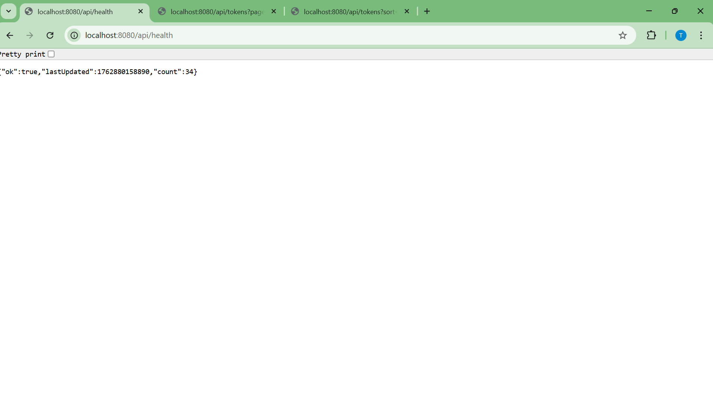
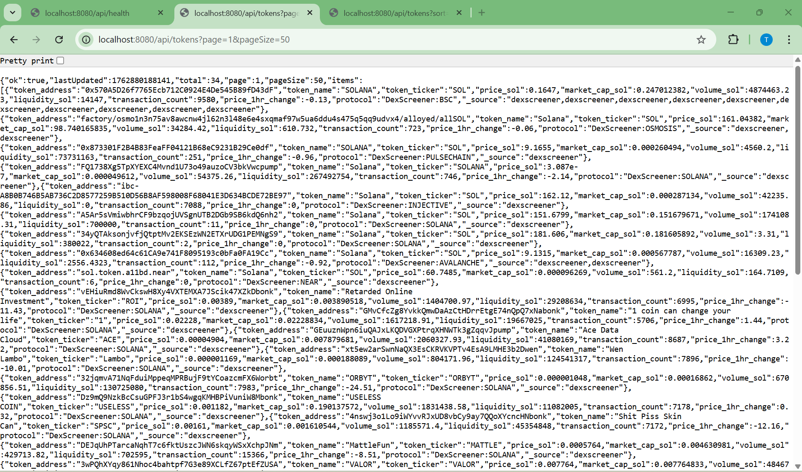
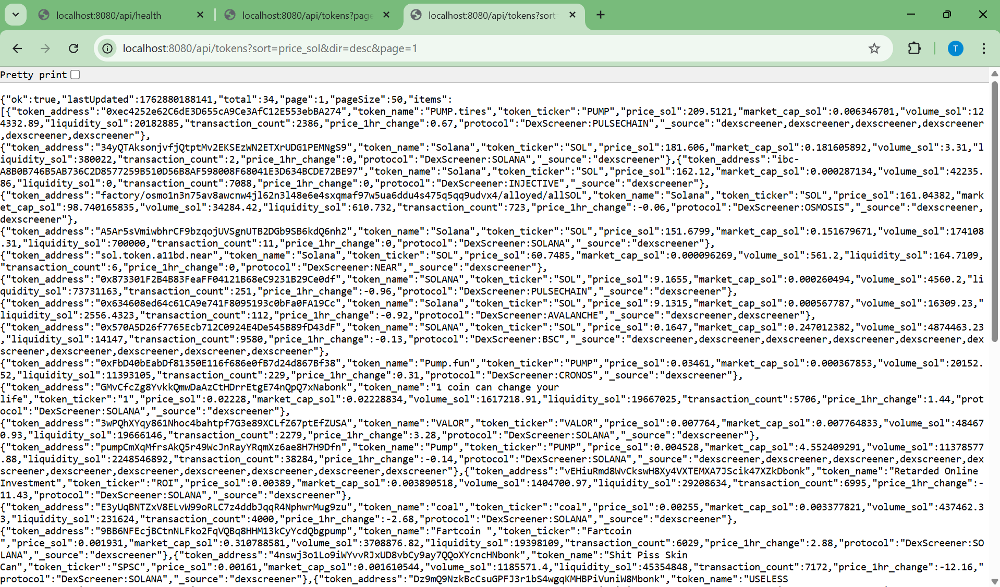

# Meme Aggregator — Real-time Data Aggregation Service

This is a small backend service that fetches token data from public APIs, merges/normalizes it, caches it in memory, and serves it via **REST** (and a lightweight **WebSocket** stream). It auto-refreshes every 30 seconds.

---

## 🔗 How to Run (Locally)

```bash
npm install
npm run dev


##  Screenshots

**Health Endpoint**


**Tokens Page 1**


**Tokens Sorted by Price**

